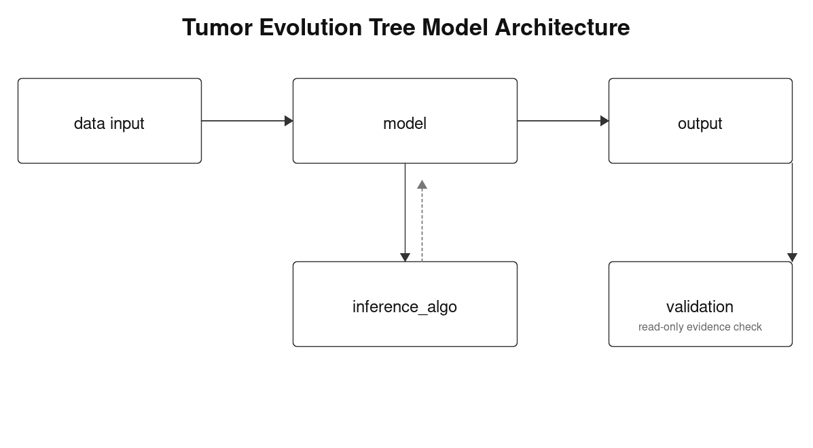

# Tumor-tree research architecture

更新日期：2026-08-24



## 核心模塊與 validation 文件引用

| 模塊 | 核心文件 | 大致責任 |
|---|---|---|
| `data input` | [`data.md`](data.md) | 定義資料來源、provenance，以及交給 model 的資料介面 |
| `model` | [`model.md`](model.md) | 定義研究要解的 model、posterior 與參數語意 |
| `inference_algo` | [`inference_algo.md`](inference_algo.md) | 定義如何根據 model 進行參數推理；目前是 SMC，之後可替換其他方法 |
| `output` | [`output.md`](output.md) | 定義如何解讀推理結果，例如 topology、CCF 與 SNV assignment |
| `validation` | [`validation.md`](validation.md) | 只讀取 output 與相關 artifacts，檢查結果可靠性、bulk compatibility 與 claim ceiling |

## 文件之間的關係

### 1. `data input → model`

`data.md` 提供 model 所需的資料介面。只要新的 data input 模塊能產生相同
的 model input contract，資料來源或前處理流程就可以替換。

### 2. `model → inference_algo`

`model.md` 定義 inference algorithm 必須解的目標與參數語意。inference
algorithm 可以替換，但必須遵守 model 所定義的 input、state 與 posterior
contract。

### 3. `inference_algo → model`

這個回圈代表 inference algorithm 會反覆將候選參數交回 model 評分，取得
下一個推理狀態；它不代表 inference algorithm 會修改 `model.md`。

### 4. `model → output`

`model.md` 定義輸出參數的意義，`output.md` 負責把這些參數轉成容易理解的
拓樸、CCF 與 SNV assignment 表示方式。

### 5. `output → validation`

`validation.md` 是 output 後的獨立、read-only 評估層。它不重新推理，也不修改
model、inference 設定或 output；只根據 run provenance、SMC diagnostics、tree
structure、CCF、SNV assignment、holdout 與 bulk CN/LOH evidence，判定目前結果
最多能支持到哪一層研究 claim。

## 可替換模塊的邊界

```text
data input     可替換資料來源與建表流程
model          可替換 posterior／likelihood 定義
inference_algo 可替換參數推理方法
output         可替換結果呈現方式
validation     可替換驗證實作，但維持 read-only evidence contract
```

前四個文件描述可替換的核心模塊；`validation.md` 描述 output 後的評估 contract。
研究流程只需要確認相鄰模塊的輸入／輸出 contract 相容，就能替換其中一個核心
模塊，而不必重寫整個研究架構。

## 實驗流程與紀錄

[`experiment_workflow.md`](experiment_workflow.md) 是核心模塊之上的編排與
稽核文件：它固定資料如何交給 model、inference algorithm 如何執行、output
如何交給 validation，並要求每個階段留下輸入 provenance、設定、QA、diagnostic
與錯誤 receipt。它不屬於核心模塊本身，因此替換任一模塊時，只要維持相鄰
contract 與紀錄格式，整體實驗流程仍可追溯。
