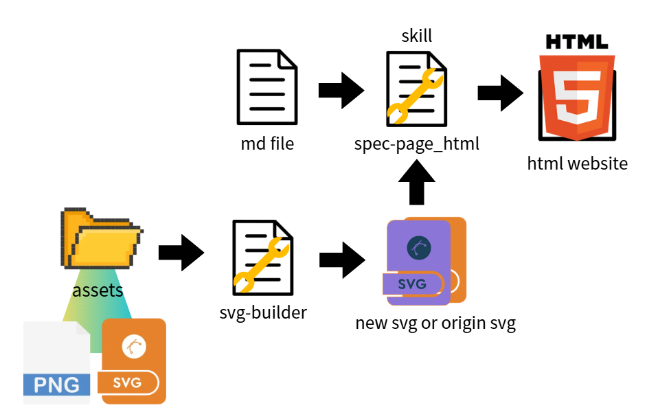
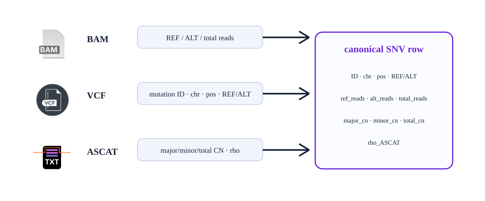
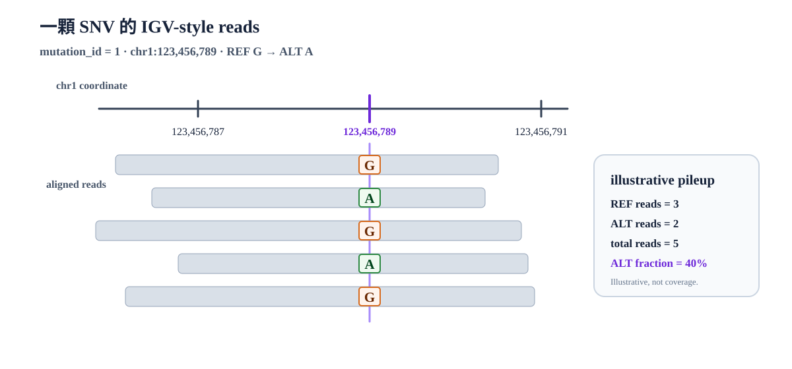
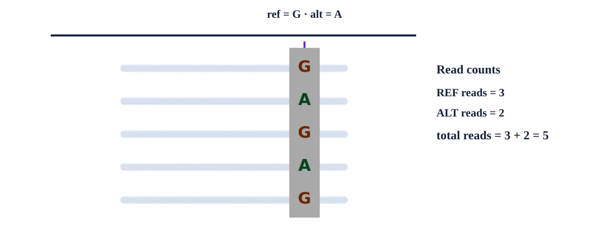
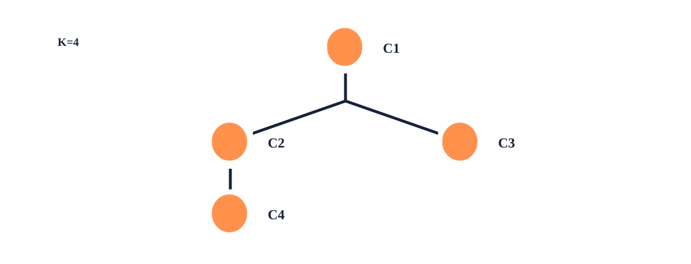
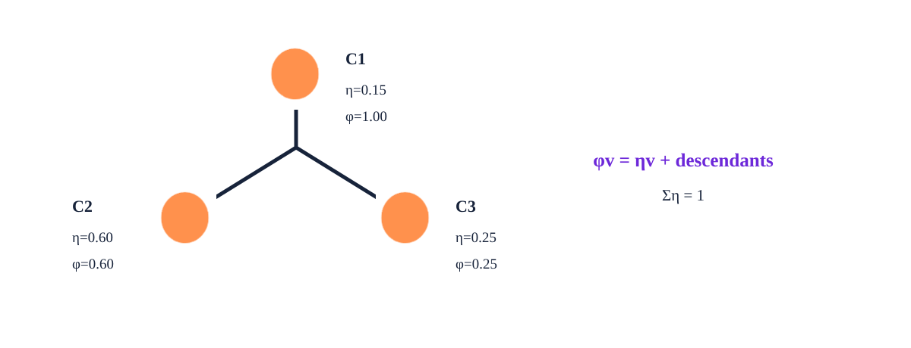
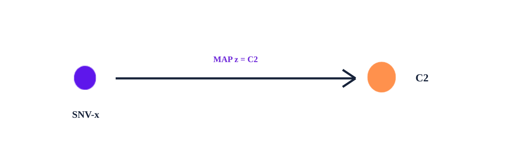

# HCC1395 腫瘤演化樹 module

更新日期：2026-08-31；狀態：本文件整理研究模組的邊界、資料流與 inference 目的；完整 model 與 inference 規格以參考文件為準。

> [!IMPORTANT]
> 這是為了目前研究架構下的html視覺化文字說明參考，避免產生混淆。
> 本文件摘要 data input、model、inference 的模組邊界與輸入輸出，供模組規格與 HTML 視覺化對照使用。
> 完整的 likelihood、prior、posterior 與推理實作細節，請以參考文件為準。


## md和svg生成html report

放上build_html_report_process.svg圖片

## 研究模組主線架構


## 1. Data input

### 目的

`data input` 把 BAM、VCF、ASCAT 的資訊轉換成一列一個 SNV 的基本資料，供 model
讀取。

### 從哪裡取得資料

| 上游來源 | 提供的資訊 |
|---|---|
| BAM | REF/ALT read counts |
| VCF | SNV identity：`mutation_id、chrom、pos、ref、alt` |
| ASCAT | tumor purity `rho_ASCAT`、site-level `major_cn/minor_cn/total_cn` 與 CN/LOH context |

### raw data轉換model基本輸入資料

| 類別 | 欄位 | 意義 |
|---|---|---|
| Identity | `mutation_id、chrom、pos、ref、alt` | 哪一顆 SNV |
| Read counts | `ref_reads、alt_reads、total_reads` | 觀察到的 REF/ALT read counts；`total_reads = ref_reads + alt_reads` |
| Purity | `rho_ASCAT` | 固定的 sample-level tumor purity；目前主分析為 `0.99` |
| Copy number | `major_cn、minor_cn、total_cn` | SNV 所在位置的 CN context；`total_cn = major_cn + minor_cn` |

## 2. Model

### model目的

Model 使用 data input SNV row 中的資訊，搭配 inference 演算法猜測出來的演化樹拓樸(T)、local clone fraction(η) 與 SNV assignment(z)去推導出 CCF 並且使用 purity + CN + multiplicity 的矯正，最後輸出預期ALT機率ξ(xi)，再與真實的 REF／ALT reads 比較得到 likelihood，最後和 prior 合併得到候選樹的 posterior。


```text
演化樹候選狀態：T + η + z
                  ↓
              推導 φ／CCF
                  ↓
         加入 purity + CN context + multiplicity 矯正
                  ↓
             預期 ALT 機率
                  ↓
      實際 ALT／REF read counts → likelihood
                  ↓
          prior × likelihood → posterior 分數
```

### 圖片與術語對應（素材紀錄）

| 文字／術語 | 找到的既有素材 | 預覽 |
|---|---|---|
| 候選樹 `T` | 收斂的 k=3 版本：`fixed_k3_clone_tree.svg` | `assets/components/previews/fixed_k3_clone_tree.png` |
| clone fraction `η` | `eta_phi_tree.svg` | `assets/components/previews/eta_phi_tree.png` |
| assignment `z` | `snv_assignment.svg` | `assets/components/previews/snv_assignment.png` |
| multiplicity | `multiplicity.svg` | `assets/components/previews/multiplicity.png` |
| 推導 `φ`／CCF | `eta_phi_tree.svg` | `assets/components/previews/eta_phi_tree.png` |
| canonical input | `/bip8_disk/boyu114/main_work/assets/png_to_svg/canonical_snv_row.svg` | `assets/components/previews/canonical_snv_row.png` |
| ALT／REF read counts | `/bip8_disk/boyu114/main_work/assets/components/read_pileup.svg` | `assets/components/previews/read_pileup.png` |
| purity／CN context | `purity_mixture.svg`、`cn_segment_context.svg` | `assets/components/previews/cn_segment_context.png` |


### 數學模型

```text
posterior ∝ prior × likelihood
```

候選腫瘤樹最後有多可信 = 原本的假設有多合理 × 它和真實資料有多吻合。

### Prior:

還沒看sequencing data 之前，哪些演化樹演化狀態比較合理。
例如:某演化樹中某一個clone的ccf 最高都是100%,不會出現超過100%的情況。

### Likelihood

假設這棵樹是真的，觀察到的sequencing data的機率有多高？

### Posterior

看到真實sequencing data後，模型猜測出來的腫瘤演化樹可信度有多高

### model輸出參數

| 參數 | 參數意義 |
|---|---|
| Tree topology `T` | 哪些 clone 是 parent／descendant？ |
| clone-specific local fraction $\eta_v$ | 每個 clone 自己獨有、且不包含 descendants 的 tumor-cell fraction 是多少？ |
| CCF／`phi` | 某 clone 加上 descendants 的累積比例是多少？ |
| Clone assignment `z` | 一顆 SNV 比較支持哪個 clone？ |

## 3. inference

### 目的

`inference` 按照 model 定義的prior 和 與結構限制，持續探索不同的腫瘤演化樹拓樸與各 clone 的比例，反覆評估哪些參數組合最能解釋目前的 sequencing data，並保留多個具有 posterior 支持的候選腫瘤演化樹結果。


## 4. 參考文件

- [data.md](data.md)：canonical data contract 與 target/spec boundary。
- [model.md](model.md)：模型語意、target posterior 與限制。
- [inference_algo.md](inference_algo.md)：目前 SMC implementation、annealing 與 output。
- [output.md](output.md)：topology、CCF 與 SNV assignment 的結果語意。
- [validation.md](validation.md)：posterior output 後的獨立 validation。

<!-- spec-paged-html:visual-feedback:start -->
## HTML 視覺化回饋

此區塊記錄 [`module_format.html`](module_format.html) 的 inline SVG／元件基礎與文字來源；重新生成時只更新本區塊。

### 版面變更記錄

- `new`：`slide-1-build-html-report` 新增為第 1 頁，使用來源段落指定的 `assets/png_to_svg/build_html_report_process.svg`。
- `moved`：既有視覺槽位整體順延一頁；保留原 visual ID、SVG、來源 `##` 與槽位數量，只更新 HTML 頁面錨點。
- `preserved`：`slide-6-output-parameters` 仍保留為歷史上的 `removed` 記錄，沒有重新加入 HTML。

### slide-1-build-html-report（new）



- HTML：[`module_format.html#slide-1`](module_format.html#slide-1)
- 保留強度：`anchored`
- 視覺槽位：`build-html-report`（1／1）
- SVG：inline SVG；`assets/png_to_svg/build_html_report_process.svg`
- 對應來源：`## md和svg生成html report`
- 涵蓋文字：來源段落指定的 build_html_report_process.svg 流程圖。

### slide-1-module-flow（updated）


- HTML：[`module_format.html#slide-2`](module_format.html#slide-2)
- 保留強度：`anchored`
- 視覺槽位：`module-flow`（1／1）
- SVG：inline SVG；`assets/png_to_svg/full_arch.svg`
- 對應來源：`## 研究模組主線架構`
- 涵蓋文字：raw data、data input、model、inference、output 的既有順序與目的。

### slide-2-source-to-row（updated）



- HTML：[`module_format.html#slide-3`](module_format.html#slide-3)
- 保留強度：`anchored`
- 視覺槽位：`source-to-row`（1／1）
- SVG：inline SVG；組裝基礎 `assets/components/source_to_input.svg`
- 對應來源：`## 1. Data input` → `### 目的`、`### 從哪裡取得資料`
- 涵蓋文字：`data input` 把 BAM、VCF、ASCAT 的資訊轉換成一列一個 SNV 的基本資料，供 model 讀取。

### slide-3-canonical-fields（updated）





- HTML：[`module_format.html#slide-4`](module_format.html#slide-4)
- 保留強度：`anchored`
- 視覺槽位：`canonical-fields`（1／1）
- SVG：inline SVG；組裝基礎 `assets/components/snv_identity_igv_reads.svg`、`assets/components/read_pileup.svg`、`assets/components/cn_segment_context.svg`、`assets/components/purity_mixture.svg`
- 對應來源：`## 1. Data input` → `### raw data轉換model基本輸入資料`
- 涵蓋文字：Identity 元件以已核准示例 `mutation_id = 1`、`chr1:123,456,789`、`G → A` 表達 `mutation_id, chrom, pos, ref, alt`，並以 IGV-style read counts 呈現共享基因座與 REF／ALT evidence。圖中同時表達 read counts、`rho_ASCAT` 與 copy number；CN 圖以已核准的示例 `major_cn = 3`、`minor_cn = 1` 表達重複 copy，並標示 `total_cn = 4`，不是由本文件推得的資料值。

### slide-4-candidate-tree（updated）


- HTML：[`module_format.html#slide-5`](module_format.html#slide-5)
- 保留強度：`anchored`
- 視覺槽位：`candidate-tree-evidence`（1／1）
- SVG：inline SVG；使用 `assets/png_to_svg/model_process.svg`；移除候選 tree 的 Root／Clone A／Clone C／Clone B 與 sequencing data REF／ALT reads 的舊雙欄圖片區域，改用六段 model scoring flow
- 對應來源：`## 2. Model` 的候選腫瘤演化樹與兩項假設
- 涵蓋文字：Root、Clone A、Clone B、Clone C 與祖先／後代、clone fraction 假設；候選狀態在此圖中只呈現 topology <code>T</code> 與 local fraction <code>η</code>。

### slide-6-output-parameters（removed）

- HTML：[`module_format.html#slide-6`](module_format.html#slide-6)
- 保留強度：`replaceable`
- 視覺槽位：`output-parameters-combined`（removed）
- 原 SVG：`assets/components/eta_phi_tree.svg`、`assets/components/snv_assignment.svg`
- 替代 visual ID：`slide-6-topology`、`slide-6-local-eta`、`slide-6-cumulative-phi`、`slide-6-clone-assignment`
- 變更：`split`；依使用者指示將四個平行參數拆成四個獨立槽位。

### slide-6-topology（updated）



- HTML：[`module_format.html#slide-7`](module_format.html#slide-7)
- 保留強度：`anchored`
- 視覺槽位：`tree-topology`（1／4）
- SVG：inline SVG；`assets/components/clone_tree.svg`
- 對應來源：`## 2. Model` → `### model輸出參數`
- 涵蓋文字：Tree topology `T` 表示哪些 clone 是 parent／descendant。

### slide-6-local-eta（updated）



- HTML：[`module_format.html#slide-7`](module_format.html#slide-7)
- 保留強度：`anchored`
- 視覺槽位：`local-eta`（2／4）
- SVG：inline SVG；聚焦 `assets/components/eta_phi_tree.svg` 的 local `eta_v` 結構
- 對應來源：`## 2. Model` → `### model輸出參數`
- 涵蓋文字：`eta_v` 是每個 clone 自己獨有、且不包含 descendants 的 tumor-cell fraction。

### slide-6-cumulative-phi（updated）


- HTML：[`module_format.html#slide-7`](module_format.html#slide-7)
- 保留強度：`anchored`
- 視覺槽位：`cumulative-phi`（3／4）
- SVG：inline SVG；聚焦 `assets/components/eta_phi_tree.svg` 的 cumulative `phi` 結構
- 對應來源：`## 2. Model` → `### model輸出參數`
- 涵蓋文字：CCF／`phi` 是某 clone 加上 descendants 的累積比例。

### slide-6-clone-assignment（updated）



- HTML：[`module_format.html#slide-7`](module_format.html#slide-7)
- 保留強度：`anchored`
- 視覺槽位：`clone-assignment`（4／4）
- SVG：inline SVG；`assets/components/snv_assignment.svg`
- 對應來源：`## 2. Model` → `### model輸出參數`
- 涵蓋文字：Clone assignment `z` 表示一顆 SNV 比較支持哪個 clone。

### slide-7-inference-module（updated）


- HTML：[`module_format.html#slide-8`](module_format.html#slide-8)
- 保留強度：`anchored`
- 視覺槽位：`inference-module-overview`（1／1）
- SVG：inline SVG；`assets/png_to_svg/inference_module.svg`
- 對應來源：`## 3. inference` → `### 目的`
- 涵蓋文字：inference 探索不同腫瘤演化樹拓樸與 clone 比例，反覆評估候選狀態，並保留具有 posterior 支持的候選結果。
<!-- spec-paged-html:visual-feedback:end -->
