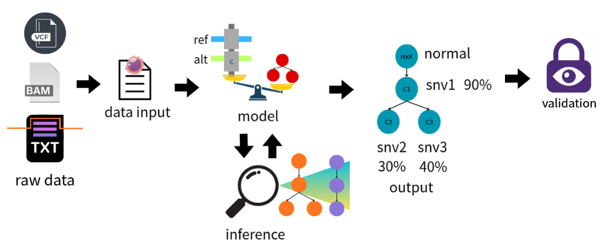
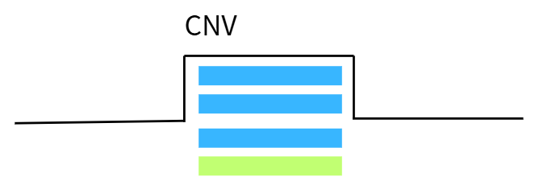
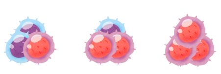
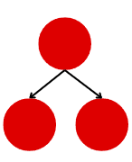
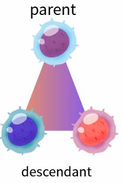
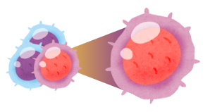
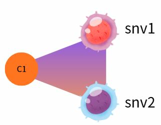
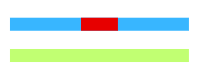

# HCC1395 腫瘤演化樹 module

更新日期：2026-08-28；狀態：本文件只保留模組邊界與資料流；likelihood、先驗與後驗說明暫時移除。

> [!IMPORTANT]
> 這是為了目前研究架構下的html視覺化文字說明參考，避免產生混淆。
> 本文件目前只描述 data input、model模組，以及這兩個模組的輸入輸出。
> 其他先保留，待後續更新

## 研究模組主線

```text
raw data → BAM / VCF / ASCAT
        ↓
data input：建立每顆 SNV 的 canonical data row
        ↓
model：用 data row 評分候選 tree、clone-specific local fraction、snv assignment
        ↓
inference：探索候選腫瘤演化樹
        ↓
output：候選腫瘤演化樹 samples、CCF/phi、snv assignment、multiplicity summary
```

BAM、VCF、ASCAT 是上游資料來源，`data input` 先建立 canonical SNV-level table。

## 1. Data input

### 一句話功能

`data input` 把 BAM、VCF、ASCAT 的資訊整理成一列一個 SNV 的基本資料，供 model
讀取。

### 從哪裡取得資料

| 上游來源 | 提供的資訊 |
|---|---|
| BAM | REF/ALT read counts |
| VCF | SNV identity：`mutation_id、chrom、pos、ref、alt` |
| ASCAT | tumor purity `rho_ASCAT`、site-level `major_cn/minor_cn/total_cn` 與 CN/LOH context |


### raw data轉換model基本輸入資料

| 類別 | 欄位 | 意義 |
|---|---|---|
| Identity | `mutation_id、chrom、pos、ref、alt` | 哪一顆 SNV |
| Read counts | `ref_reads、alt_reads、total_reads` | 觀察到的 REF/ALT read counts；`total_reads = ref_reads + alt_reads` |
| Purity | `rho_ASCAT` | 固定的 sample-level tumor purity；目前主分析為 `0.99` |
| Copy number | `major_cn、minor_cn、total_cn` | SNV 所在位置的 CN context；`total_cn = major_cn + minor_cn` |


## 2. Model

Model 的主要目的是讀取 data input 整理出的 canonical SNV table。它把表中的 read counts、purity 和 copy number，連同候選 tree 的 clone fraction 及模型內部建立的 multiplicity，計算成候選 tree 的分數，讓 inference 模組負責探索不同候選樹並根據分數更新參數。

假設有一顆腫瘤演化樹
```
Root
  │
  ├── Clone A
  │      └── Clone B
  │
  │
  └── Clone C
```

Model 必須先對這個腫瘤演化樹故事做一些假設：

1. 祖先 clone 原則上會被後代 clone 繼承。
2. 不同 clone 有不同腫瘤細胞比例，而這些比例最後會影響我們在真實 sequencing data中看到多少 ALT reads。

之後必須讓電腦了解這個腫瘤演化樹故事，就必須寫成數學模型。

### 數學模型
```
posterior ∝ prior × likelihood
```
候選腫瘤樹最後有多可信 = 原本的假設有多合理 × 它和真實資料有多吻合。

### Prior:
還沒看sequencing data 之前，哪些演化樹演化狀態比較合理。
例如:某演化樹中某一個clone的ccf 最高都是100%,不會出現超過100%的情況。

###  Likelihood
假設這棵樹是真的，觀察到的sequencing data的機率有多高？

### Posterior
看到真實sequencing data後，模型猜測出來的腫瘤演化樹可信度有多高

### model輸出參數
| 參數 | 參數意義 |
|---|---|
| Tree topology `T` | 哪些 clone 是 parent／descendant？ |
| clone-specific local fraction $\eta_v$ | 每個 clone 自己獨有、且不包含 descendants 的 tumor-cell fraction 是多少？ |
| CCF／`phi` | 某 clone 加上 descendants 的累積比例是多少？ |
| Clone assignment `z` | 一顆 SNV 比較支持哪個 clone？ |


## 6. 參考文件

- [data.md](data.md)：canonical data contract 與 target/spec boundary。
- [model.md](model.md)：模型語意、target posterior 與限制。
- [inference_algo.md](inference_algo.md)：目前 SMC implementation、annealing 與 output。
- [output.md](output.md)：topology、CCF 與 SNV assignment 的結果語意。
- [validation.md](validation.md)：posterior output 後的獨立 validation。

<!-- spec-paged-html:visual-feedback:start -->
## HTML 視覺化回饋

此區塊記錄 [`module_format.html`](module_format.html) 使用的 SVG 與文字來源；重新生成時只更新本區塊。

### slide-1-full-arch（new）


- HTML：[`module_format.html#slide-1`](module_format.html#slide-1)
- SVG：`assets/svg_version/full_arch.svg`
- 對應來源：`## 研究模組主線`
- 涵蓋文字：raw data → BAM / VCF / ASCAT → data input → model → inference → output。
- 備註：本回饋只對應上述主線；SVG 原圖的其他標籤不新增本文件敘事。

### slide-1-bam-source（new）


- HTML：[`module_format.html#slide-1`](module_format.html#slide-1)
- SVG：`assets/svg_version/bam.svg`
- 對應來源：`## 1. Data input` → `### 從哪裡取得資料`
- 涵蓋文字：BAM 提供 REF/ALT read counts。

### slide-1-vcf-source（new）


- HTML：[`module_format.html#slide-1`](module_format.html#slide-1)
- SVG：`assets/svg_version/vcf.svg`
- 對應來源：`## 1. Data input` → `### 從哪裡取得資料`
- 涵蓋文字：VCF 提供 SNV identity：`mutation_id、chrom、pos、ref、alt`。

### slide-1-ascat-source（new）


- HTML：[`module_format.html#slide-1`](module_format.html#slide-1)
- SVG：`assets/svg_version/cnv_data.svg`
- 對應來源：`## 1. Data input` → `### 從哪裡取得資料`
- 涵蓋文字：ASCAT 提供 tumor purity `rho_ASCAT`、site-level copy number 與 CN/LOH context。

### slide-2-bam-read-counts（new）


- HTML：[`module_format.html#slide-2`](module_format.html#slide-2)
- SVG：`assets/svg_version/bam.svg`
- 對應來源：`## 1. Data input` → `### 從哪裡取得資料`
- 涵蓋文字：BAM 的 REF/ALT read counts。

### slide-2-vcf-identity（new）


- HTML：[`module_format.html#slide-2`](module_format.html#slide-2)
- SVG：`assets/svg_version/vcf.svg`
- 對應來源：`## 1. Data input` → `### 從哪裡取得資料`
- 涵蓋文字：VCF 的 SNV identity：`mutation_id、chrom、pos、ref、alt`。

### slide-2-ascat-cn（new）


- HTML：[`module_format.html#slide-2`](module_format.html#slide-2)
- SVG：`assets/svg_version/cnv_data.svg`
- 對應來源：`## 1. Data input` → `### 從哪裡取得資料`
- 涵蓋文字：ASCAT 的 `rho_ASCAT`、`major_cn/minor_cn/total_cn` 與 CN/LOH context。

### slide-2-cnv-context（new）


- HTML：[`module_format.html#slide-2`](module_format.html#slide-2)
- SVG：`assets/svg_version/cnv_region_reads.svg`
- 對應來源：`## 1. Data input` → `### raw data轉換model基本輸入資料`
- 涵蓋文字：SNV 所在位置的 CN context：`major_cn、minor_cn、total_cn`。

### slide-2-purity（new）


- HTML：[`module_format.html#slide-2`](module_format.html#slide-2)
- SVG：`assets/svg_version/purity.svg`
- 對應來源：`## 1. Data input` → `### raw data轉換model基本輸入資料`
- 涵蓋文字：固定的 sample-level tumor purity `rho_ASCAT`；目前主分析為 `0.99`。

### slide-3-chromosome-identity（new）


- HTML：[`module_format.html#slide-3`](module_format.html#slide-3)
- SVG：`assets/svg_version/chromosome.svg`
- 對應來源：`## 1. Data input` → `### raw data轉換model基本輸入資料`
- 涵蓋文字：Identity 欄位 `mutation_id、chrom、pos、ref、alt` 用於表示哪一顆 SNV。

### slide-3-cnv-read-context（new）


- HTML：[`module_format.html#slide-3`](module_format.html#slide-3)
- SVG：`assets/svg_version/cnv_region_reads.svg`
- 對應來源：`## 1. Data input` → `### raw data轉換model基本輸入資料`
- 涵蓋文字：Read counts 是 `ref_reads、alt_reads、total_reads`；copy number 是 `major_cn、minor_cn、total_cn`。

### slide-4-branch-tree（new）


- HTML：[`module_format.html#slide-4`](module_format.html#slide-4)
- SVG：`assets/svg_version/branch_tree.svg`
- 對應來源：`## 2. Model` 的候選腫瘤演化樹
- 涵蓋文字：Root、Clone A、Clone B 與 Clone C 的候選樹例子。

### slide-4-parent-descendant（new）


- HTML：[`module_format.html#slide-4`](module_format.html#slide-4)
- SVG：`assets/svg_version/parent_descendant.svg`
- 對應來源：`## 2. Model` 的假設 1
- 涵蓋文字：祖先 clone 原則上會被後代 clone 繼承。

### slide-6-ccf-phi（new）


- HTML：[`module_format.html#slide-6`](module_format.html#slide-6)
- SVG：`assets/svg_version/CCF.svg`
- 對應來源：`## 2. Model` → `### model輸出參數`
- 涵蓋文字：CCF／`phi` 是某 clone 加上 descendants 的累積比例。

### slide-6-snv-assignment（new）


- HTML：[`module_format.html#slide-6`](module_format.html#slide-6)
- SVG：`assets/svg_version/snv_to_clone_assignment.svg`
- 對應來源：`## 2. Model` → `### model輸出參數`
- 涵蓋文字：Clone assignment `z` 表示一顆 SNV 比較支持哪個 clone。

### slide-6-multiplicity（new）


- HTML：[`module_format.html#slide-6`](module_format.html#slide-6)
- SVG：`assets/svg_version/multiplicity.svg`
- 對應來源：`## 研究模組主線` 與 `## 2. Model`
- 涵蓋文字：output 包含 multiplicity summary；model 連同模型內部建立的 multiplicity 計算候選 tree 的分數。
<!-- spec-paged-html:visual-feedback:end -->
